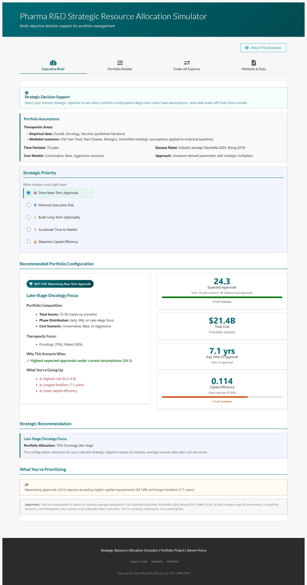
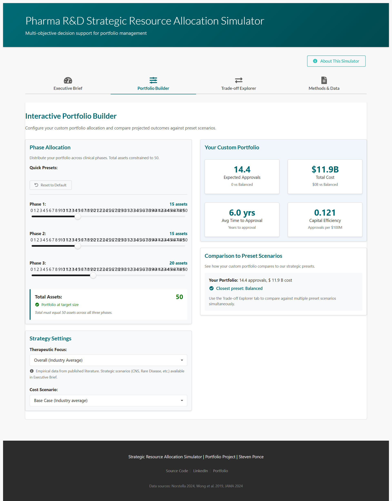
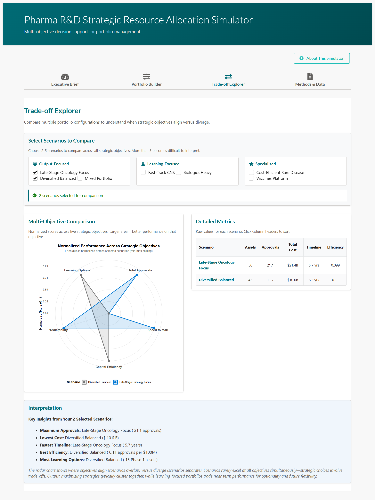

# Pharma R&D Strategic Portfolio Simulator

## Overview

This project is an **interactive decision-support simulator** designed to explore **strategic trade-offs in pharmaceutical R&D portfolio allocation**.

Rather than optimizing a single metric or predicting outcomes, the simulator evaluates how different **portfolio configurations perform across competing strategic objectives**, including speed to market, capital efficiency, learning optionality, and expected approvals.

The goal is **structural insight**, not prescription.

    

------------------------------------------------------------------------

## Live Dashboard

🔗 **Interactive simulator (ShinyApps.io):**  
[Pharma R&D Simulator](https://0l6jpd-steven-ponce.shinyapps.io/Pharma_R-D/)


------------------------------------------------------------------------

## Dashboard Preview

Selected views illustrating the strategic framework and decision-support structure:

### Executive Brief

\
*Strategic priority selection with hypothesis-driven recommendations*

### Portfolio Builder

\
*Interactive resource allocation with real-time trade-off feedback*

### Trade-off Explorer

\
*Multi-scenario comparison using normalized radar charts*

------------------------------------------------------------------------

## Purpose

The simulator helps answer questions such as:

-   When do strategic objectives align versus conflict?
-   Under what conditions does specialization outperform diversification?
-   How do therapeutic area risk profiles alter portfolio outcomes?
-   What trade-offs emerge when prioritizing learning versus near-term output?

This tool is intended for **exploratory analysis and strategic discussion**, not investment decision-making.

------------------------------------------------------------------------

## What This Simulator Does *Not* Do

To avoid overreach, the simulator explicitly **does not**:

-   Predict individual asset success or failure
-   Recommend investment levels or portfolio sizes
-   Model company-specific pipelines
-   Estimate financial return, valuation, or NPV
-   Optimize portfolios against a single objective

All results are **conditional on assumptions** and support structured thinking, not conclusions.

------------------------------------------------------------------------

## Analytical Framework

### Strategic Objectives

Portfolios are evaluated across five strategic objectives, each representing a **testable hypothesis** about organizational priorities:

1.  **Maximize Expected Approvals**
2.  **Minimize Risk (Predictability)**
3.  **Maximize Learning Optionality** (early-stage exposure)
4.  **Speed to Market**
5.  **Capital Efficiency** (approvals per \$100M)

There is no single “correct” objective — trade-offs are expected and intentional.

------------------------------------------------------------------------

### Portfolio Scenarios

The simulator evaluates multiple portfolio configurations that vary by:

-   Stage allocation (early vs late)
-   Therapeutic focus
-   Development timelines
-   Cost structures

#### Empirical (Literature-Based) Therapeutic Areas

These scenarios use published transition probabilities and timelines:

-   Overall (industry average)
-   Oncology
-   Vaccines
-   Anti-Infectives

#### Modeled Strategic Scenarios

Additional scenarios (e.g., Fast-Track CNS, Rare Disease Focus, Biologics Heavy) apply **transparent modeling assumptions** on top of empirical baselines to explore “what-if” strategic postures.

------------------------------------------------------------------------

## Data Sources & Assumptions

### Empirical Inputs

Baseline risk and attrition dynamics are drawn from peer-reviewed and industry sources:

-   Wong et al. (2019)
-   Norstella (2024)
-   ACSH (2020)

### Modeled Assumptions

Where published data does not exist, assumptions are applied via explicit multipliers (e.g., faster timelines, higher success rates). These are:

-   Documented
-   Adjustable
-   Intended for sensitivity testing, not realism claims

------------------------------------------------------------------------

## Normalization & Comparison

To enable comparison across objectives with different units:

-   Performance metrics are **min–max normalized** across selected scenarios
-   Radar charts visualize **relative performance**, not absolute magnitude
-   Larger area indicates stronger performance *within the comparison set*

Normalization does **not** imply equal importance across objectives.

------------------------------------------------------------------------

## Key Design Principles

-   Multi-objective, not single-metric optimization
-   Transparency over complexity
-   Explainability over black-box scoring
-   Decision support, not automation
-   Assumption-aware results

These principles mirror real-world portfolio discussions.

------------------------------------------------------------------------

## Limitations

-   Results are expectation-based, not probabilistic forecasts
-   Learning is proxied by early-stage exposure, not scientific output
-   Strategic scenarios rely on simplified assumptions
-   No competitive or market dynamics are modeled

These limitations are intentional to preserve interpretability.

------------------------------------------------------------------------

## Intended Audience

Designed for:

-   R&D strategy and portfolio management
-   Trial analytics and insights teams
-   Decision-support and simulation practitioners
-   Analysts interested in multi-objective trade-off frameworks

------------------------------------------------------------------------

## Summary

This simulator demonstrates how **portfolio outcomes depend less on optimization and more on explicitly stated priorities**.

By making trade-offs visible, it supports clearer, more disciplined strategic conversations.

------------------------------------------------------------------------

## Repository Structure

```         
Pharma_R&D/
├── app.R                          
├── global.R                       
├── server.R                      
├── ui.R                          
│
├── modules/                       
│   ├── mod_executive_brief.R
│   ├── mod_portfolio_builder.R
│   ├── mod_tradeoff_explorer.R
│   └── mod_methods.R
│
├── R/                             
│   ├── simulation_functions.R     
│   ├── scenario_builder.R         
│   └── setup_runtime.R           
│
├── data/                          
│   ├── processed/                 
│   │   ├── phase_transitions.rds
│   │   ├── trial_durations.rds
│   │   ├── cost_estimates.rds
│   │   └── therapeutic_areas.rds
│   └── scenarios/                 
│       └── preset_scenarios.rds
│
├── screenshots/                   
└── README.md                      
```

------------------------------------------------------------------------

## License

This project is released under the **MIT License**.

------------------------------------------------------------------------

## Disclaimer

This project is for **educational and exploratory purposes only**.

It does not constitute financial, investment, or clinical advice.

This simulator is **not affiliated with, endorsed by, or produced by any pharmaceutical company**.

All parameters are derived from publicly available peer-reviewed literature. No representation is made regarding applicability to specific company contexts.

------------------------------------------------------------------------

## Contact

**Steven Ponce**\
Data Analyst \| R Shiny Developer \| Business Intelligence Specialist

🔗 **Portfolio Website**: [stevenponce.netlify.app](https://stevenponce.netlify.app/projects.html)\
🐙 **GitHub**: [\@poncest](https://github.com/poncest)\
💼 **LinkedIn**: [stevenponce](https://www.linkedin.com/in/stevenponce/)\
🐦 **X (Twitter)**: [\@sponce1](https://x.com/sponce1)

------------------------------------------------------------------------

*Prepared by Steven Ponce as part of a professional analytics portfolio.*\
*Demonstrating strategic thinking, simulation methodology, and executive decision-support design.*
